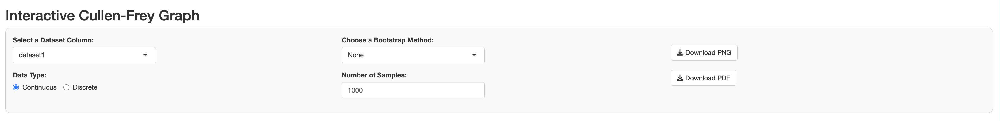
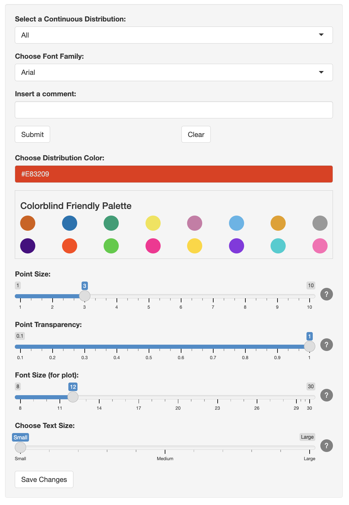
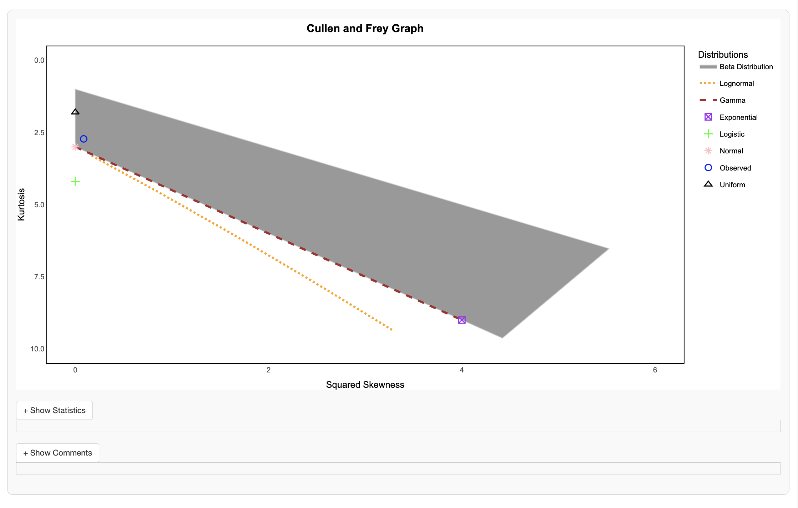

```{r, include = FALSE}
knitr::opts_chunk$set(
  collapse = TRUE,
  comment = "#>"
)
```

# Overview of CullenFreyX

The **CullenFreyX** package provides an interactive Shiny application to visualize the Cullen-Frey graph, which is used to analyze skewness and kurtosis of different datasets. This package helps in comparing observed data distributions with theoretical distributions such as Normal, Uniform, Logistic, Exponential, Lognormal, and Gamma distributions.

## Installation

You can install the development version of the package from GitHub using:


```{r}
devtools::install_github("https://github.com/aniusk898/CullenFreyX")
```

Once installed, you can load the package:

```{r}
library(CullenFreyX)
```

The main feature of this package is an interactive Shiny application, which can be launched with the following command:

```{r}
data = rnorm(100) #Generate a dataset to test the app
launch_cullen_frey_app(data) # Launch the app

```
This will launch the Cullen-Frey interactive graph application in a new window. In this app, you can interact with datasets, adjust graph settings, and customize the appearance of the graph. Once the app is running, you will be able to:

- **Select a Dataset**: Choose datasets from a dropdown menu that automatically populates based on the data input.
- **Select Data Type**: Toggle between continuous or discrete distributions, depending on your dataset.
- **Bootstrap Sampling Options**: Choose from different bootstrap methods (or none) and specify the number of samples.
- **Customize Distribution Colors**: Use the colourInput feature or select from pre-defined colorblind-friendly palettes to change the colors of the displayed distributions.
- **Insert Comments**: Add custom comments for each distribution, which will be displayed on hover in the graph.
- **Adjust Display Settings**: You can dynamically adjust the point size, transparency (alpha), and font size for the plot.
- **Enable/Disable Distributions**: Toggle the visibility of specific distributions to focus on certain types of data or analysis.
- **Download Graph**: Export the graph in PNG format or download a report in PDF format with the graph, statistics, and comments included.

# Dataset and Download Controls Panel

```{r, fig.align="center", out.width="80%", echo=FALSE}

```

- **Title**: "Interactive Cullen-Frey Graph"
- This panel allows users to select the dataset and configure bootstrapping settings for the analysis:
  - **Select a Dataset Column**: Dropdown to select a specific dataset column for analysis.
  - **Data Type**: Radio buttons to switch between analyzing continuous and discrete data.
  - **Choose a Bootstrap Method**: Dropdown to select different bootstrapping methods (Bootstrap Samples or Bootstrap Unbiased).
  - **Number of Samples**: Numeric input to define the number of bootstrap samples to be generated.
  - **Download PNG / PDF**: Buttons that allow users to download the graph as a PNG image or generate a PDF report, including statistics and comments.

# Distribution and Aesthetic Controls Panel

```{r, fig.align="center", out.width="30%", echo=FALSE}

```

- This panel provides controls for customizing the appearance and behavior of the plot:
  - **Select a Continuous Distribution**: A dropdown allows users to choose which distribution they want to analyze or compare.
  - **Choose Font Family**: A dropdown to select the font style used in the plot's labels.
  - **Insert a Comment**: A text input where users can add comments to their plot for reference.
  - **Choose Distribution Color**: A color picker to change the color assigned to the selected distribution.
  - **Colorblind Friendly Palette**: A set of color buttons that provide preset color options for colorblind users.
  - **Point Size**: A slider to adjust the size of the data points in the plot.
  - **Point Transparency**: A slider to control the transparency of the points plotted in the Cullen-Frey graph.
  - **Font Size**: A slider to adjust the font size used in the plot.
  - **Text Size**: A slider to adjust the text size for the entire app interface.
  - **Save Changes**: A button to save the chosen settings and apply them to the plot.

# Interactive Plot Display Panel
```{r, fig.align="center", out.width="50%", echo=FALSE}

```

- This central panel displays the Cullen-Frey graph, which includes the observed distribution plotted alongside theoretical distributions (Normal, Uniform, Logistic, Exponential, etc.). 
- The plot has a labeled legend on the right-hand side, indicating each distribution's name and corresponding color.
- Users can visually compare the skewness and kurtosis of the observed data against theoretical distributions.
- The plot responds dynamically based on user-selected data, color, point size, and transparency.


### Comments in Tooltips
```{r, fig.align="center", out.width="30%", echo=FALSE}
knitr::include_graphics("images/tooltip.png")

```

# Examples os usage
```{r}
# Example 1: Named list of numeric vectors
data1 <- list(a = rnorm(100), b = runif(100))

# Example 2: Unnamed list of numeric vectors
data2 <- list(rpois(100, lambda = 5), rexp(100))

# Example 3: Simple numeric vector
data3 <- rnorm(10)

# Example 4: Matrix (which can be treated as a list of columns)
data4 <- matrix(rnorm(20), nrow = 10, ncol = 2)

# Example 5: Named numeric vector
data5 <- c(a = rnorm(100), b = runif(100))

# Example 6😬: Unnamed numeric vector
data6 <- c(rnorm(3), runif(100))


# Example 7: Empty data frame
data7 <- data.frame()

```

# Cullen and Frey Plot
The Cullen-Frey plot is a visual tool based on concepts and techniques developed by Cullen and Frey in their 1999 work \citep{CullenFrey1999}. This plot is used in statistical analysis to identify the appropriate distribution of a dataset by comparing its measurements (skewness and kurtosis) with the known characteristics of theoretical distributions. Skewness measures the symmetry of the distribution: positive skewness indicates that the right tail is heavier than the left tail, while negative skewness indicates the opposite. Kurtosis measures the ``sharpness" of the distribution: high kurtosis indicates heavier tails and higher peaks, while low kurtosis indicates a flatter distribution with lighter tails.

## Objectives
The primary objective is to develop an R package that creates an interactive, customizable, and exportable Cullen-Frey plot. 

## User expectations
The idea is that the proposed package will provide efficient and user-friendly implementations on Cullen-Frey plot allowing import multiple samples, export and customize the plot, and also explore relevant information with a simple click.

