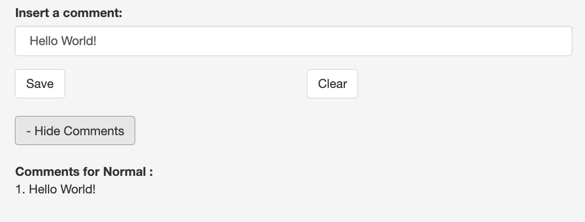

```{r, include = FALSE}
knitr::opts_chunk$set(
  collapse = TRUE,
  comment = "#>"
)
```

# Overview of CullenFreyX

The **CullenFreyX** package provides an interactive Shiny application to visualize the Cullen-Frey graph, which is used to analyze skewness and kurtosis of different datasets. This package helps in comparing observed data distributions with theoretical distributions such as Normal, Uniform, Logistic, Exponential, Lognormal, and Gamma distributions.

## Installation

You can install the development version of the package from GitHub using:


```{r}
devtools::install_github("https://github.com/aniusk898/CullenFreyX")
```

Once installed, you can load the package:

```{r}
library(CullenFreyX)
```

The main feature of this package is an interactive Shiny application, which can be launched with the following command:
```{r}
data = rnorm(100) #Generate a dataset to test the app
launch_cullen_frey_app(data) # Launch the app
```
This will launch the application in a new window, where you can select datasets, customize distributions, and adjust colors using an interactive palette.
Once the app is running, you can:

- Select datasets from a dropdown menu.
- Choose between bootstrap sampling methods.
- Customize the colors of distributions using the `colourInput` or pre-defined colorblind-friendly buttons.
- Insert comments for each distribution.
- Activate/deactivate distributions display.

### Running the Bootstrap Method
```{r, fig.align="center", out.width="70%", echo=FALSE}

```

follow these steps to perform the bootstrap analysis:

1. **Select a Dataset**: First, choose the dataset you want to analyze from the *"Select Dataset"* dropdown menu.
   
2. **Select the Bootstrap Method**: Next, pick a bootstrap method from the dropdown:
   - **Bootstrap Samples**: This method generates standard bootstrap samples.
   - **Bootstrap Unbiased**: This method generates unbiased bootstrap samples for more accurate estimates.

3. **Set the Number of Bootstrap Samples**: Adjust the number of bootstrap samples interactively by using the numeric input field. This allows you to see real-time updates as the number of samples changes.

The app will update the plot based on your choices, displaying the bootstrap results accordingly.


### Customizing Distribution Colors
```{r, fig.align="center", out.width="70%", echo=FALSE}
knitr::include_graphics("images/colourPicker.png")

```

The app provides real-time customization of distribution colors, but first, you must select the distribution you wish to customize. After selecting the distribution from the dropdown menu, you can adjust its color using two options:

1. **Colour Picker**: Click on the color picker labeled *"Choose Distribution Color"* to open a palette, and select your preferred color.

2. **Colorblind-Friendly Preset Buttons**: Alternatively, you can choose a preset from the colorblind-friendly buttons for easy selection of accessible colors.

This customization allows for a clearer visual distinction between different distributions in the graph.

### Inserting Comments
```{r, fig.align="center", out.width="70%", echo=FALSE}


```
A useful feature of the app is the ability to add comments for each distribution, which can be saved and displayed interactively.
Within the app:

-Select a distribution.
-Type a comment in the text box.
-Click "Save" to store the comment.
-Use the "Show Comments" button to toggle visibility of saved comments

### Comments in Tooltips
```{r, fig.align="center", out.width="70%", echo=FALSE}
knitr::include_graphics("images/tooltip.png")

```
