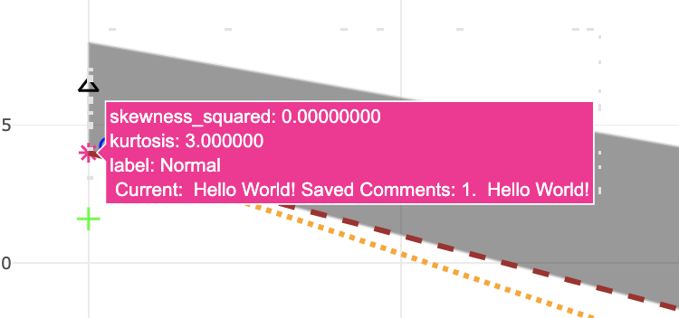

```{r, include = FALSE}
knitr::opts_chunk$set(
  collapse = TRUE,
  comment = "#>"
)
```
# Overview of CullenFreyX

The **CullenFreyX** package provides an interactive Shiny application to visualize the Cullen-Frey graph, which is used to analyze skewness and kurtosis of different datasets. This package helps in comparing observed data distributions with theoretical continuous distributions such as Normal, Uniform, Logistic, Exponential, Lognormal, Beta,etc or discrete distributions like Poisson or Negative Binomial.
## Installation

You can install the development version of the package from GitHub using:


```{r, eval=FALSE}
devtools::install_github("https://github.com/aniusk898/CullenFreyX")
```

Once installed, you can load the package:

```{r}
library(CullenFreyX)
```

# Cullen and Frey Plot
The Cullen-Frey plot is a visual tool based on concepts and techniques developed by Cullen and Frey in their 1999 work [@CullenFrey1999]. This plot is used in statistical analysis to identify the appropriate distribution of a dataset by comparing its measurements (skewness and kurtosis) with the known characteristics of theoretical distributions. Skewness measures the symmetry of the distribution: positive skewness indicates that the right tail is heavier than the left tail, while negative skewness indicates the opposite. Kurtosis measures the ``sharpness" of the distribution: high kurtosis indicates heavier tails and higher peaks, while low kurtosis indicates a flatter distribution with lighter tails.

## Objectives
The primary objective is to develop an R package that creates an interactive, customizable, and exportable Cullen-Frey plot. 

## User expectations
The idea is that the proposed package will provide efficient and user-friendly implementations on Cullen-Frey plot allowing import multiple samples, export and customize the plot, and also explore relevant information with a simple click.

# Functions


## `data_moment` 

This utility function is used to compute the higher-order moments (such as the second, third, and fourth moments) necessary for calculating variance, skewness, and kurtosis.

The k-th central moment is calculated as:
The \( k \)-th moment of a dataset \( x_1, x_2, \dots, x_n \) about the mean \( \mu \) is given by:

\[
M_k = \frac{1}{n} \sum_{i=1}^{n} (x_i - \mu)^k
\]

- The first moment \( M_1 \) represents the mean of the dataset.
- The second moment \( M_2 \) gives us the variance of the data.
 
Moments play a critical role in determining the shape of the distribution, with higher-order moments (such as skewness and kurtosis) being essential for analyzing the tails and symmetry of the distribution.

## `method.unbiased` and `method.sample`

In stats, we often talk about **sample moments** and **unbiased moments**. The Cullen-Frey package lets you calculate both skewness and kurtosis, depending on what you need. The key thing to know is that **sample moments** are calculated directly from your data, but they tend to have a bit of bias, especially when you’re working with small datasets. This bias isn’t a big deal with large datasets, but in smaller ones, it can lead to misinterpreting your data’s skewness or kurtosis [@joanes1998comparing].

To fix this, **unbiased moments** add a correction factor to give a more accurate picture, especially when working with smaller samples. So, it’s important to know when to use **sample** versus **unbiased** stats to avoid misinterpretations.

### Sample Skewness and Kurtosis


The **sample skewness** formula is used to measure how symmetrical the data is. The formula is:

$$
\text{Sample Skewness} = \frac{\sum_{i=1}^{n} \left( \frac{x_i - \bar{x}}{s} \right)^3}{n} =\frac{M_3}{(M_2)^{3/2}} 
$$

Where:
- \(n\) is the number of observations.
- \(x_i\) is each data point.
- \(\bar{x}\) is the mean of the data.
- \(s\) is the standard deviation.

This formula gives an idea of whether your data is skewed to the left or right, but it can be a little off for smaller datasets since it doesn’t account for bias. That's why we sometimes apply corrections when the sample size is small [@joanes1998comparing].


Kurtosis tells you how "peaked" or "flat" your distribution is compared to a normal distribution. Here's the formula for **sample kurtosis**:

$$
\text{Sample Kurtosis} = \frac{\sum_{i=1}^{n} \left( \frac{x_i - \bar{x}}{s} \right)^4}{n}= \frac{M_4}{M_2^2}
$$
Like skewness, **sample kurtosis** might be biased in small samples [@decarlo1997].

### Unbiased Skewness and Kurtosis


When working with small datasets, we use **unbiased skewness** to fix the bias in the sample skewness formula. The adjusted formula looks like this:

$$
\text{Unbiased Skewness} = \frac{\sqrt{n(n-1)}}{n-2} \cdot \text{Sample Skewness} =  \frac{\sqrt{n(n-1)}}{n-2} \cdot \frac{M_3}{(M_2)^{3/2}}
$$

This formula helps give a better estimate of skewness for smaller datasets [@fisher1930moments].


Similarly, we adjust kurtosis for small datasets to get **unbiased kurtosis**. The formula is a bit more complex:

$$
\text{Unbiased Kurtosis} = \frac{(n-1)}{(n-2)(n-3)} \left[(n+1)\left( \frac{\sum_{i=1}^{n} \left( \frac{x_i - \bar{x}}{s} \right)^4}{n} \right) - 3(n-1)\right] + 3
$$

This adjustment helps provide a clearer picture of the data's shape when working with small samples [@joanes1998comparing].


So, when analyzing data, especially if your sample size is small, it’s important to understand the difference between **sample** and **unbiased** stats. The unbiased versions are particularly helpful because they correct for the bias present in small datasets, making your analysis more accurate.


## `calculate_statistics` 

This function calculates various statistical measures such as minimum, maximum, median, skewness, and kurtosis (either sample or unbiased) for a given dataset. It serves as a helper function designed to extract key statistical properties from the data, ensuring that all necessary checks and calculations are handled appropriately.

- **Null and Empty Data Handling**: The function begins by checking if the input dataset is `NULL` or empty. If either condition is true, it raises an appropriate error to prevent invalid processing of the data.

- **Type and Validity Checks**: Next, the function ensures that the dataset is a numeric vector. Additionally, it checks for any `NA` or `Inf` values, which would indicate invalid data points, and raises errors if any are found. This helps to maintain the integrity of the calculations by ensuring the data is clean and ready for analysis.

- **Skewness and Kurtosis Calculations**: For datasets containing fewer than 4 data points, skewness and kurtosis are not calculated since both measures require a minimum of 4 observations to be meaningful.
 In cases where the dataset has zero variance (i.e., all values are identical), skewness and kurtosis are set to 0 because there is no variability in the data to calculate these measures.

- **Handling Sample or Unbiased Method**: The function supports both "sample" and "unbiased" methods for calculating skewness and kurtosis. The **sample method** computes skewness and kurtosis based directly on the dataset. and the **unbiased method** applies corrections to provide unbiased estimates for skewness and kurtosis, which is especially useful for small datasets.

This function can be used independently from the app, but it only accepts numeric data. It calculates basic statistical measures, including minimum, maximum, median, variance, skewness, and kurtosis.

```{r}
data = c(1, 2, 3, 4, 5, 6, 7, 8, 9, 10)
calculate_statistics(data)

```

For the observed dataset, the default behavior in the package is to calculate unbiased statistics for skewness and kurtosis. This is especially useful when working with sample data and want to estimate population parameters without the bias introduced by small sample sizes.

## `data_type.continuous` and `data_type.discrete`

The `data_type.continuous` function is used to generate continuous distribution data for the Cullen-Frey graph. This graph includes theoretical lines for distributions like **Beta**, **Gamma**, and **Lognormal**. The formulas for skewness and kurtosis used in this function are derived from theoretical models and are similar to those implemented in the `fitdistrplus` package for distribution fitting and graphical representation [@fitdistrplus].


- **Beta Distribution Polygon**:
The Beta distribution's skewness and kurtosis are modeled using specific theoretical formulas:

$$
s^2 = \frac{4 \cdot (e^{lq} - e^{-a})^2 \cdot (e^{-a} + e^{lq} + 1)}{(e^{-a} + e^{lq} + 2)^2 \cdot e^{-a} \cdot e^{lq}}
$$

$$
k = \frac{3 \cdot (e^{-a} + e^{lq} + 1) \cdot (e^{-a} \cdot e^{lq} \cdot (e^{-a} + e^{lq} - 6) + 2 \cdot (e^{-a} + e^{lq})^2)}{e^{-a} \cdot e^{lq} \cdot (e^{-a} + e^{lq} + 2) \cdot (e^{-a} + e^{lq} + 3)}
$$

These equations generate the data needed to create the Beta distribution polygon, which is then plotted on the Cullen-Frey graph.

- **Gamma Line**:
The Gamma distribution’s skewness and kurtosis follow the relationship:

$$
Kurtosis = \frac{3}{2} \cdot Skewness^2 + 3
$$

This linear relation allows us to generate the Gamma distribution line on the Cullen-Frey graph [@fitdistrplus].

- **Lognormal Line**:
For the Lognormal distribution, the skewness and kurtosis are calculated using the following equations:

$$
s^2 = \frac{(e^x + 2)^2}{(e^x - 1)}
$$

$$
k = e^{4x} + 2e^{3x} + 3e^{2x} - 3
$$

These theoretical values are plotted as a curve to represent the Lognormal distribution on the graph.

The theoretical points represent the skewness and kurtosis of observed data and  specific theoretical distributions. These points help to visualize and compare the shape characteristics of different continuous and discrete distributions.

- **Normal Distribution**: 
  - Skewness: 0
  - Kurtosis: 3
  - The normal distribution is symmetric, with no skewness, and its kurtosis is set to 3 by definition, which represents a normal "peakedness" relative to other distributions.
  
- **Uniform Distribution**: 
  - Skewness: 0
  - Kurtosis: 1.8
  - The uniform distribution is also symmetric (no skewness), but it has a lower kurtosis, meaning it has less "peakedness" and lighter tails than the normal distribution.
  
- **Logistic Distribution**: 
  - Skewness: 0
  - Kurtosis: 4.2
  - Like the normal distribution, the logistic distribution is symmetric (no skewness), but it has a higher kurtosis, meaning it has heavier tails and a more pronounced peak compared to the normal distribution.
  
- **Exponential Distribution**: 
  - Skewness: 2
  - Kurtosis: 9
  - The exponential distribution is not symmetric (skewness of 2), and it has heavy tails, as reflected by its high kurtosis. This makes it more prone to extreme values.

### Discrete Data and Distributions:
The `data_type.discrete` function handles discrete datasets, such as those that fit **Negative Binomial** or **Poisson** distributions. It calculates skewness and kurtosis based on the specific characteristics of these distributions. The theoretical points here are the observed data and Normal distribution with the same characteristics as before mentioned.

- **Negative Binomial Distribution**:
For the Negative Binomial distribution, the skewness and kurtosis formulas are as follows:

$$
s^2 = \frac{(2 - e^{-a})^2}{e^{lr} \cdot (1 - e^{-a})}
$$


$$
k = 3 + \frac{6}{e^{lr}} + \frac{(e^{-a})^2}{e^{lr} \cdot (1 - e^{-a})}
$$

- **Poisson Distribution Line**:
The Poisson distribution’s skewness and kurtosis are calculated with these simple formulas:

$$
s^2 = \frac{1}{\lambda}
$$

$$
y = 3 + \frac{1}{\lambda}
$$

These formulas define the shape of the Poisson distribution curve on the Cullen-Frey graph, and are implemented similarly to how they are used in the `fitdistrplus` package [@fitdistrplus].

## `Bootstrap_method`

This function, written in **Rcpp**, implements a general bootstrap method to estimate skewness and kurtosis for a given dataset. Bootstrapping is a statistical technique that involves repeatedly sampling from a dataset (with or without replacement) to generate multiple bootstrap samples. For each sample, skewness and kurtosis are calculated, allowing for robust statistical estimation. This function gives users the option to compute these statistics using either the sample method or the unbiased method [@efron1994introduction].


## `run_app`
This is the core function that launches the Shiny app for visualizing distributions using the Cullen-Frey graph. It handles the interactive elements like data selection, distribution display, and customization

```{r}
data <-rpois(100, lambda = 5)
run_app(data) # Launch the app

```
This will launch the Cullen-Frey interactive graph application in a new window. In this app, you can interact with datasets, adjust graph settings, and customize the appearance of the graph. Once the app is running, you will be able to:

- **Select a Dataset**: Choose datasets from a dropdown menu that automatically populates based on the data input.
- **Select Data Type**: Toggle between continuous or discrete distributions, depending on your dataset.
- **Select Method Type**: Toggle between sample or ubiased calculations, depends on the user preferences.
- **Bootstrap Sampling Options**: Choose from different bootstrap methods (or none) and specify the number of samples.
- **Customize Distribution Colors**: Use the colourInput feature or select from pre-defined colorblind-friendly palettes to change the colors of the displayed distributions.
- **Insert Comments**: Add custom comments for each distribution, which will be displayed on hover in the graph.
- **Adjust Display Settings**: You can dynamically adjust the point size, transparency (alpha), and font size for the plot.
- **Enable/Disable Distributions**: Toggle the visibility of specific distributions to focus on certain types of data or analysis.
- **Download Graph**: Export the graph in PNG format or download a report in PDF format with the graph, statistics, and comments included.

# Dataset and Download Controls Panel

```{r, fig.align="center", out.width="80%", echo=FALSE}
knitr::include_graphics("images/1.png")
```

- **Title**: "Interactive Cullen-Frey Graph"
- This panel allows users to select the dataset and configure bootstrapping settings for the analysis:
  - **Select a Dataset Column**: Dropdown to select a specific dataset column for analysis.
  - **Data Type**: Radio buttons to switch between analyzing continuous and discrete data.
  - **Choose a Bootstrap Method**: Dropdown to select different bootstrapping methods (Bootstrap Samples or Bootstrap Unbiased).
  - **Number of Samples**: Numeric input to define the number of bootstrap samples to be generated.
  - **Download PNG / PDF**: Buttons that allow users to download the graph as a PNG image or generate a PDF report, including statistics and comments.

# Distribution and Aesthetic Controls Panel

```{r, fig.align="center", out.width="30%", echo=FALSE}
knitr::include_graphics("images/2.png")
```

- This panel provides controls for customizing the appearance and behavior of the plot:
  - **Select a Continuous Distribution**: A dropdown allows users to choose which distribution they want to analyze or compare.
  - **Choose Font Family**: A dropdown to select the font style used in the plot's labels.
  - **Insert a Comment**: A text input where users can add comments to their plot for reference.
  - **Choose Distribution Color**: A color picker to change the color assigned to the selected distribution.
  - **Colorblind Friendly Palette**: A set of color buttons that provide preset color options for colorblind users.
  - **Point Size**: A slider to adjust the size of the data points in the plot.
  - **Point Transparency**: A slider to control the transparency of the points plotted in the Cullen-Frey graph.
  - **Font Size**: A slider to adjust the font size used in the plot.
  - **Text Size**: A slider to adjust the text size for the entire app interface.
  - **Save Changes**: A button to save the chosen settings and apply them to the plot.

# Interactive Plot Display Panel
```{r, fig.align="center", out.width="50%", echo=FALSE}

```

- This central panel displays the Cullen-Frey graph, which includes the observed distribution plotted alongside theoretical distributions (Normal, Uniform, Logistic, Exponential, etc.). 
- The plot has a labeled legend on the right-hand side, indicating each distribution's name and corresponding color.
- Users can visually compare the skewness and kurtosis of the observed data against theoretical distributions.
- The plot responds dynamically based on user-selected data, color, point size, and transparency.


### Comments in Tooltips
```{r, fig.align="center", out.width="30%", echo=FALSE}


```

# `launch_cullen_frey_app`
This function launches the `run_app()` application, allowing users to visualize the skewness and kurtosis of various datasets and distributions. This function accepts flexible input formats, including vectors, lists of vectors, or dataframes, and processes the data to ensure all elements have appropriate names before launching the interactive visualization app.

The main purpose of launch_cullen_frey_app is to handle different types of input data and ensure that they are correctly formatted before passing them to run_app() for visualization. This makes launch_cullen_frey_app more flexible in terms of input data types compared to run_app(), which requires properly structured data.. So, the differences between this function and `run_app()` are: 

- **Input Flexibility**: The function works with different data structures such as vectors, lists, and dataframes. If a vector is provided, it’s converted into a list. If a list is provided without names for each dataset, the function automatically assigns names (`"dataset1"`, `"dataset2"`, etc.).
  
- **Data Processing**: The function contains an internal helper function `process_input_data` that handles the following tasks:
  - If the input is a vector, it is wrapped into a list.
  - If the input is a list, it ensures all datasets are named. Unnamed datasets are assigned default names.
  
- **App Launch**: Once the input data is processed, it is passed to the `run_app` function, which starts the interactive Cullen-Frey graph application. Users can then explore skewness and kurtosis of their datasets through this visualization tool.


# Examples os usage
```{r}
set.seed(10)

#Generate Continuous Distributions
normal_data <- rnorm(100, mean = 0, sd = 1)
uniform_data <- runif(1000, min = 0, max = 1)
logistic_data <- rlogis(1000, location = 0, scale = 1)
gamma_data <- rgamma(10000, shape = 2, rate = 1)
exp_data <- rexp(100000, rate = 1)
lognormal_data <- rlnorm(100000, meanlog = 0, sdlog = 0.5)
beta_data <- rbeta(1000, shape1 = 2, shape2 = 5)


continuous_data_list <- list(
  normal = normal_data,
  uniform = uniform_data,
  logistic = logistic_data,
  gamma = gamma_data,
  exponential = exp_data,
  lognormal = lognormal_data,
  beta = beta_data
)

set.seed(10)
# Generate Discerete Distributions
poisson_data <- rpois(1000, lambda = 3)
negative_binomial_data <- rnbinom(100000, size = 10, prob = 0.5)


discrete_data_list <- list(
  poisson = poisson_data,
  negative_binomial = negative_binomial_data
)


data_small <- rnorm(10)  # Small dataset with 10 points
data_medium <- rnorm(1000)  # Medium dataset with 1000 points
data_large <- rnorm(10000)  # Large dataset with 10000 points
data_very_large <- rnorm(1e6)  # Very large dataset with 1 million points

list_of_datasets_varied <- list(
  Small = data_small,
  Medium = data_medium,
  Large = data_large,
  Very_Large = data_very_large
)


# Example 1: Named list of numeric vectors
data1 <- list(a = rnorm(100), b = runif(10))

# Example 2: Unnamed list of numeric vectors
data2 <- list(rpois(100, lambda = 5), rexp(100))

# Example 3: Simple numeric vector
data3 <- rnorm(10)

# Example 4: Matrix (which can be treated as a list of columns)
data4 <- matrix(rnorm(20), nrow = 10, ncol = 2)

# Example 5: Named numeric vector
data5 <- c(a = rnorm(100), b = runif(100))

# Example 6 : Unnamed numeric vector
data6 <- runif(100)


# Example 7: Empty data frame - It will show the app but not the distributions
data7 <- data.frame()


set.seed(10)
lognormal_data <- rlnorm(100000, meanlog = 0, sdlog = 0.5)
descdist(lognormal_data)
```


# References
